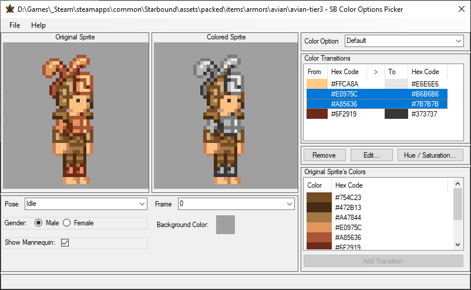
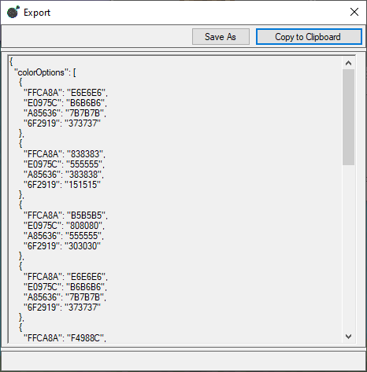

# Starbound - Color Options Picker

## Contents
* [Overview](#overview)
* [Requirements](#requirements)
* [Setup](#setup)

## Overview
"Color Options Picker" - is a utility for more convenient color matching for the "colorOptions" parameter.

Here's an example of exporting data:

## Requirements
* [.NET Framework 4.5](https://www.microsoft.com/en-us/download/details.aspx?id=30653)
	
## Setup
To run this utility, download [the latest release](/releases).

