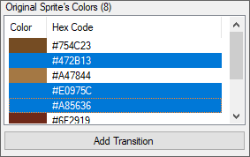
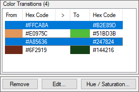
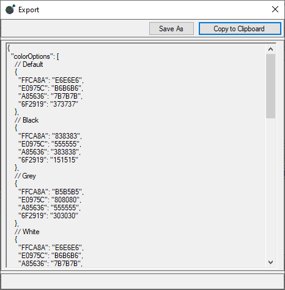

# Starbound - Color Options Picker

## Contents
* [Overview](#overview)
* [Requirements](#requirements)
* [Setup](#setup)
* [Usage](#usage)

## Overview
"Color Options Picker" - an application for more convenient color matching for the "colorOptions" parameter.

## Requirements
* [.NET Framework 4.5](https://www.microsoft.com/en-us/download/details.aspx?id=30653)

## Setup
To run this application, download [the latest release](../../releases).

## Wiki

The [Wiki](../../wiki) describes in detail the features and nuances of the program tools.

## Usage
First you need to open the folder that contains the files related to the costume. These files have the extensions .head, .chest, .legs, and .back.
Click ***File -> Open...*** and select a folder.

After that, you should see a picture of your costume and the colors that appear in the "Original Sprite's Colors" list.
Also, if JSON files have a "colorOptions" parameter, its entries will appear in the "Color Transitions" list.

Note that you can only edit one type of dye at a time. By default, the dye type is "Default". Use the "Color Option" combo box to change the type of dye.

To add editable colors, select them from the "Original Sprite's Colors" list and click the **"Add Transition"** button.

If these colors were not already in the list, then they will be added to "Color Transitions".
Now you can select colors in the "Color Transitions" list and click one of the three buttons: **"Remove"**, **"Edit..."** or **"Hue / Saturation"**.

* The **"Remove"** button simply removes the selected colors from the list.
* The **"Edit ..."** button opens a new window where you select a transition color. These, as I call them, "transition colors" are displayed on your suit in the image under the "Colored Sprite" label.

* The **"Hue / Saturation"** button opens a new window where you edit the hue, saturation and brightness of the selected transition colors.

It is important to be aware of another color selection option. You can select a specific color for editing by clicking on a pixel in the image under the "Colored Sprite" label.

After choosing the colors, in order to export these entries back to the filled "colorOptions" parameter, select ***File -> Export -> Color Options...***

Here is an example of exported data:

	
You can select the lines of code you need and copy them, or click the **"Copy to Clipboard"** button, or save everything to a text file.

